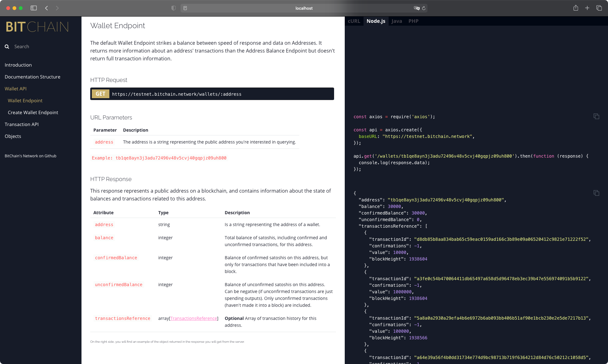

<h1 align="center">
  BitChain Docs
</h1>

  
  

This repository contains all of BitChain's Network documentation

<h6 align="center">
    <em>The documentation above was created with <a href="https://github.com/slatedocs/slate">Slate</a>. 
      Check it out at <a href="https://docs.bitchain.network">docs.bitchain.network</a>.
    </em>
</h6>

## ▶️ Getting started

To get started with BitChain Docs, please check out the Slate [wiki](https://github.com/slatedocs/slate/wiki#getting-started).

Slate supports running Docs in three different ways:
* [Natively](https://github.com/slatedocs/slate/wiki/Using-Slate-Natively)
* [Using Vagrant](https://github.com/slatedocs/slate/wiki/Using-Slate-in-Vagrant)
* [Using Docker](https://github.com/slatedocs/slate/wiki/Using-Slate-in-Docker)

## 💻 Development Process

The contribution workflow is described in [CONTRIBUTING.md](CONTRIBUTING.md).

## 📝 License

Bitchain Network is released under the MIT License. Please refer to the [LICENSE](LICENSE) file that accompanies this project for more information including complete terms and conditions.

## 💜 Special Thanks

